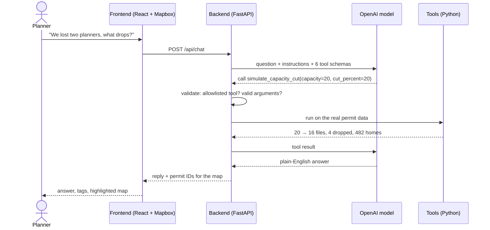
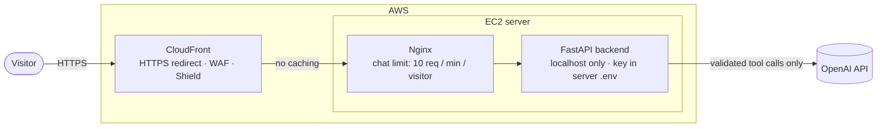
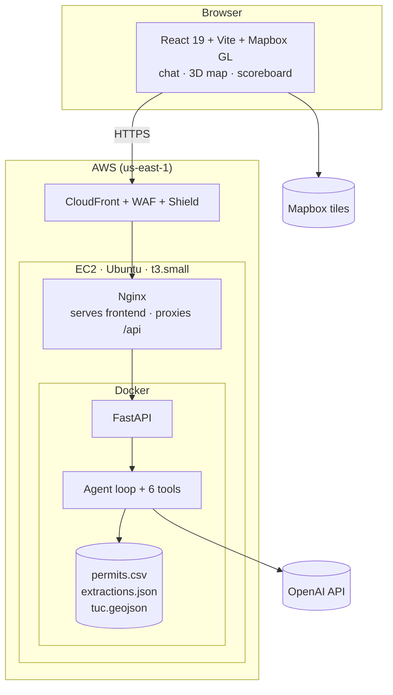

<div align="center">

# PermitPilot

### An AI agent that helps Calgary planners clear the permits that create the most homes first

**Team The Chimichangas** · IEEE YP Industry Hackathon 2026 · Energy & Infrastructure stream (Case 7)

[](https://d17k5s197xf40g.cloudfront.net)


</div>

---

## The problem

Calgary needs housing, and every new home starts as a **development permit** that a City planner must review. Today the queue is worked roughly oldest-first, so the files that would add the most homes often wait the longest.

What we found in the case data (2,000 residential permits):

| Finding | Number |
|---|---|
| Files that **actually need a planner decision** right now | **86** (the rest are on hold, already decided, or finished) |
| Median review time: multi-family vs secondary suites | **172 days vs 42 days** |
| Descriptions that state a unit count | **22** (the rest hide it in free text) |
| Queue files dating from 2019 | **34** |

Home counts hide in text like *"ROWHOUSE (2 BUILDINGS), TOWNHOUSE (2 BUILDINGS), SECONDARY SUITE (15 SUITES)"*, so no simple sort can rank files by impact.

## The solution

A planning team lead chats with PermitPilot in plain English. The agent picks the right tool, our code calculates the answer from the real data, and the agent explains it while highlighting the permits on a 3D map.

> **Planner:** *"We lost two planners this week, what drops?"*
> **PermitPilot:** *"Assuming 10 planners normally clear 20 files a week, losing two reduces capacity to 16. Four secondary-suite files drop, and homes in the list go from 486 to 482. One dropped file is near the Transportation Utility Corridor and may need extra checks."*

## Results

Same weekly workload of 20 files:

| | Oldest-first (baseline) | **PermitPilot** | PermitPilot, 2 planners lost |
|---|:---:|:---:|:---:|
| Homes in this week's list | 28 | **486** | **482** |
| Multi-family files | 1 | **8** | **8** |
| Files reviewed | 20 | 20 | 16 |

**17× more homes for the same effort.** Losing two of ten planners only drops four single-home suites; every large housing file stays.

> **Trade-off we state openly:** oldest-first clears more total overdue days (51,341 vs 38,477), because PermitPilot prioritises homes. Planners stay in control.

<p align="center">
  
  
</p>

---

## How the agent works

**The AI reads and explains; Python does the maths.** The model never invents a number.



### The six tools

All tools are **read-only**: they look things up and calculate, but never change data or make decisions.

| Tool | What it does | Try asking |
|---|---|---|
| `search_permits` | Filter by area, type, size or distance to the utility corridor, then sort | *"Top 5 multi-family files in NE"* |
| `rank_queue` | This week's review list, oldest-first or by PermitPilot priority | *"What should we review first?"* |
| `simulate_capacity_cut` | Re-plan when planners are lost; show what drops | *"We lost two planners, what drops?"* |
| `get_permit` | Explain one file: rank, days overdue, home count with evidence | *"Why is DP2025-02163 ranked 5th?"* |
| `compare_rankings` | Oldest-first vs PermitPilot side by side | *"How does this compare to oldest-first?"* |
| `clear_map` | Show every permit again | *"Show all"* |

### How it picks a tool: function calling

1. With each question, the model receives the six tools, each with a **name, a description and a strict JSON schema** of allowed arguments.
2. The model replies with a structured tool call instead of an answer.
3. The backend **rejects unknown tools and invalid arguments** (Pydantic), then runs the tool.
4. The model reads the result and either answers or calls another tool, **up to 6 steps per question**.

### The ranking

```
priority = homes × (1 + days over target ÷ target days) × 1.1 in established areas
```

The target is the **median review time for that permit category**, learned from 800 finished files.

### AI home counting, with evidence

An LLM read all **741 unique permit descriptions once** and returned a home count plus an **exact quote from the text as evidence**.

- If the quote isn't found word-for-word, or the model is unsure, the count is **flagged for a planner** and a conservative estimate is used instead.
- In the queue: **58 counts are AI-confident, 28 are flagged.** The app shows this as an "AI-counted" or "estimate, planner to confirm" tag.
- Results are cached in `backend/data/extractions.json`, so the live demo doesn't depend on this step.

### Utility corridor awareness

Using the City's **Transportation Utility Corridor** map (provincial land for the Stoney Trail ring road and major power and pipeline routes), PermitPilot measures every permit's distance to the corridor. Files within 300 m are tagged, and the agent says they *"may need extra checks such as a provincial referral"*. It never claims a decision.

---

## Security measures



### 1. The AI agent
| Measure | What it prevents |
|---|---|
| **Only 6 allowlisted, read-only tools** | The agent can't write, delete, browse, send messages or run code |
| **Strict JSON schemas + Pydantic validation** | Invented tools or malformed arguments are rejected before anything runs |
| **Every number comes from Python** | Hallucinated figures and "approvals" |
| **Max 6 AI steps, 2,000-character messages, last 10 turns only** | Runaway loops and oversized, expensive requests |
| **Evidence quotes verified against the source text** | Home counts the model can't back up are flagged, not trusted |
| **Instructions to stay careful** ("may need extra checks", never "approved" or "refused") | Overconfident or decision-like claims |

### 2. Prompt injection
The agent has very little power to abuse. It can't change data, never sees secrets, and only returns text. The worst case is an off-topic reply. Replies are rendered as **plain text by React**, so a malicious reply can't inject code into the page.

### 3. Secrets
- The OpenAI key lives **only in a `.env` file on the server**: never in the repo, the Docker image, the browser, or the prompt.
- All `.env` files are **git-ignored**. Only `.env.example` templates are committed.
- The Mapbox token is a **public, browser-safe** token by design.

### 4. Network and infrastructure
| Layer | Protection |
|---|---|
| **CloudFront** | HTTPS for every visitor (HTTP is redirected) and **AWS Shield Standard** against network DDoS |
| **AWS WAF** | Managed rules block common web attacks and known bad IPs; a rate-based rule (300 requests / 5 min / IP) counts floods, ready to switch to blocking |
| **Nginx** | Chat rate limit: 10 messages per minute per visitor (excess gets HTTP 429) |
| **Backend container** | Bound to `127.0.0.1` only, so it's reachable solely through Nginx and never directly from the internet |
| **No caching of API responses** | One visitor's answer is never served to another |
| **Same-origin + CORS allowlist** | The site and API share one address; other websites can't call the API from a visitor's browser unless explicitly allowed |

### 5. Reliability
- If the AI or backend is unavailable, the app **falls back to a rule-based keyword agent**, so the demo never goes blank.
- **17 automated tests** cover status groups, review targets, home counts, ranking, the capacity cut, corridor distances and the agent's safety rules (unknown tools, bad arguments, step limit).

---

## Architecture and deployment



| Layer | Technology |
|---|---|
| AI | OpenAI Responses API, function calling in strict mode |
| Backend | Python 3.11, FastAPI, pandas, NumPy, Pydantic |
| Frontend | React 19, TypeScript, Vite, Mapbox GL (2D/3D) |
| Data | Calgary permit case file, Open Calgary Transportation Utility Corridor |
| Infra | Docker, Nginx, AWS EC2, CloudFront, WAF, Shield |
| Tests | pytest, TypeScript type-check |

## Project structure

```
PermitPilot/
├── backend/
│   ├── app/
│   │   ├── main.py          # API endpoints
│   │   ├── data.py          # load permits, status groups, review targets
│   │   ├── homes.py         # rule-based home estimate + cached AI counts
│   │   ├── extract.py       # one-off AI home counting with evidence quotes
│   │   ├── corridor.py      # distance to the utility corridor
│   │   ├── ranker.py        # ranking, capacity cut, scoreboard, search
│   │   └── agent/
│   │       ├── tools.py     # the 6 tools + strict schemas
│   │       └── loop.py      # function-calling loop and agent rules
│   ├── data/                # permits.csv, extractions.json, tuc.geojson
│   ├── tests/               # 17 pytest tests
│   └── Dockerfile
└── frontend/
    └── src/
        ├── App.tsx          # chat, scoreboard, demo questions
        ├── MapView.tsx      # Mapbox 2D/3D map
        ├── api.ts           # calls to the backend
        └── agent.ts         # offline fallback agent
```

## Run it locally

**Backend** (Windows PowerShell):

```powershell
cd backend
py -3.11 -m venv .venv
.\.venv\Scripts\python.exe -m pip install -r requirements.txt
copy .env.example .env        # add OPENAI_API_KEY and OPENAI_MODEL
.\.venv\Scripts\python.exe -m uvicorn app.main:app --reload --port 8000
```

**Frontend** (second terminal):

```powershell
npm install
cd frontend
copy .env.example .env        # add VITE_MAPBOX_TOKEN
npm run dev
```

Open **http://localhost:5173**. API docs are at http://localhost:8000/docs. Run the tests with `python -m pytest -q` in `backend/`.

## API

| Method | Endpoint | Returns |
|---|---|---|
| `GET` | `/api/health` | Status and whether the AI agent is enabled |
| `GET` | `/api/summary` | Permit counts per status group, learned review targets |
| `GET` | `/api/permits` | Every permit with home count, evidence, corridor distance |
| `GET` | `/api/permits/{id}` | One permit and its rank |
| `GET` | `/api/queue?mode=pilot\|fifo` | This week's ranked list |
| `GET` | `/api/scoreboard` | Oldest-first vs PermitPilot vs fewer planners |
| `GET` | `/api/corridor` | Utility corridor shapes (GeoJSON) |
| `POST` | `/api/chat` | The agent: reply, permit IDs for the map, tool trace |

---

## Limitations and next steps

**Limitations**
- Home counts are estimates. 28 of 86 are flagged for a planner to confirm.
- Some 2019 files may be stale.
- PermitPilot recommends an order; it never approves or refuses a permit.

**Next steps**
- **Land Use Bylaw search (RAG)** as a seventh tool, with section citations
- Zoning-district join, transit and school proximity
- Read-only pilot with one City planning team, measuring homes moved through review against the baseline

## Team The Chimichangas

| Name | Role |
|---|---|
| **Aakash Suryavanshi** | Backend, AI agent, data pipeline, AWS deployment and security |
| **Harsingh Sekhon** | Frontend, map and 3D view |
| **Khalid Mehmood** | Utility-industry and geospatial expertise, data validation, problem framing |

<div align="center">

Built in 48 hours at Hunter Hub, University of Calgary · October 2026

</div>
